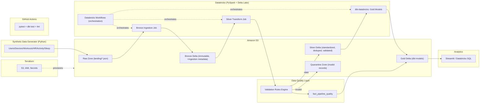

# FitnessPulse — Architecture

## Project Definition
FitnessPulse is a cloud-native data lakehouse that ingests simulated wearable and
workout-platform telemetry (workouts, heart rate, daily activity, sleep) and processes
it through a Bronze/Silver/Gold medallion architecture on AWS S3 and Databricks using
PySpark and Delta Lake, with dbt Core modeling the Gold analytics layer, pytest and dbt
tests enforcing data quality with a quarantine path for invalid records, Terraform
provisioning all AWS infrastructure reproducibly, and GitHub Actions running CI —
culminating in trustworthy analytics on workout activity, sleep, training load,
recovery trends, engagement, and pipeline health, with an optional Kafka + Structured
Streaming extension layered on after the batch MVP is solid.

## MVP Scope
- Python synthetic data generator (7 domains, with intentional dirty data) — complete
- S3 raw zone + Databricks/PySpark Bronze ingestion with lineage metadata
- S3 raw zone + Databricks/PySpark Bronze ingestion with lineage metadata
- Silver: schema standardization, dedup, quarantine, validation rules
- dbt Core (dbt-databricks) Gold models: `dim_user`, `dim_device`, `dim_date`,
  `fact_workout`, `fact_daily_health`, `fact_training_load`, `fact_pipeline_quality`
- Data quality framework + quarantine + pipeline observability
- Terraform for all AWS resources (S3, IAM, secrets)
- GitHub Actions CI (pytest, dbt tests/build, lint)
- Streamlit or Databricks SQL dashboard
- Databricks Workflows for orchestration

## Deferred (post-MVP)
- Kafka in Docker Compose + Databricks Structured Streaming
- Airflow (only if Databricks Workflows proves insufficient)
- ML/anomaly detection, Redshift, Glue, Kinesis, MSK, Kubernetes — explicitly out of scope

## Architecture Diagram

## Technology Stack
| Layer | Choice |
|---|---|
| Cloud platform | AWS |
| Storage | Amazon S3 |
| Compute | Databricks + PySpark |
| Table format | Delta Lake |
| Transformation | dbt Core (dbt-databricks) |
| Testing | pytest, dbt tests |
| CI/CD | GitHub Actions |
| IaC | Terraform |
| Dashboard | Streamlit / Databricks SQL |
| Orchestration | Databricks Workflows |